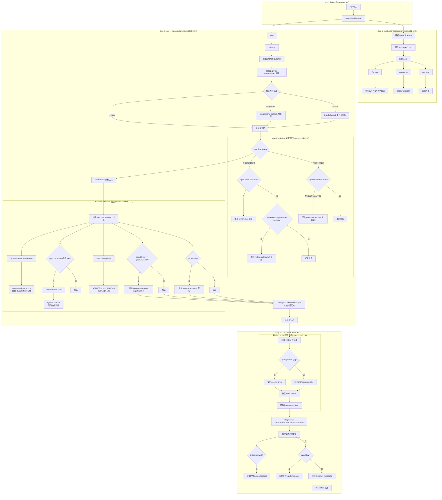
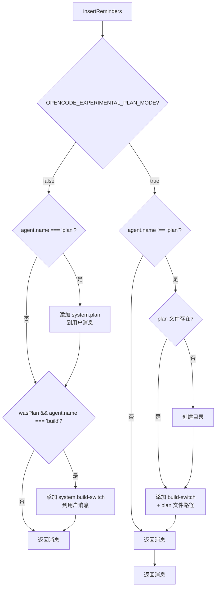
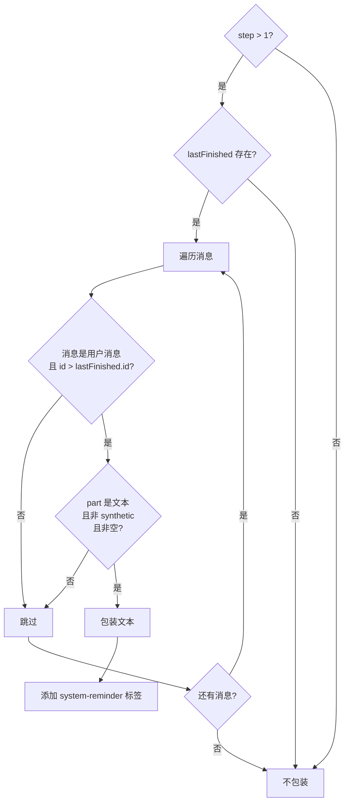
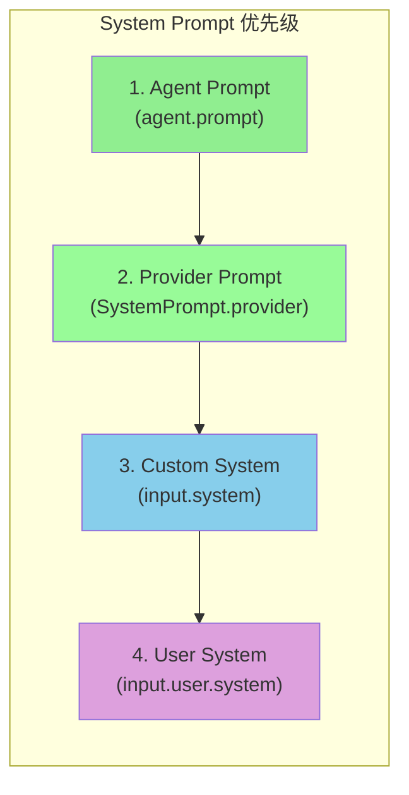
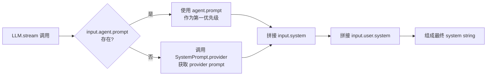
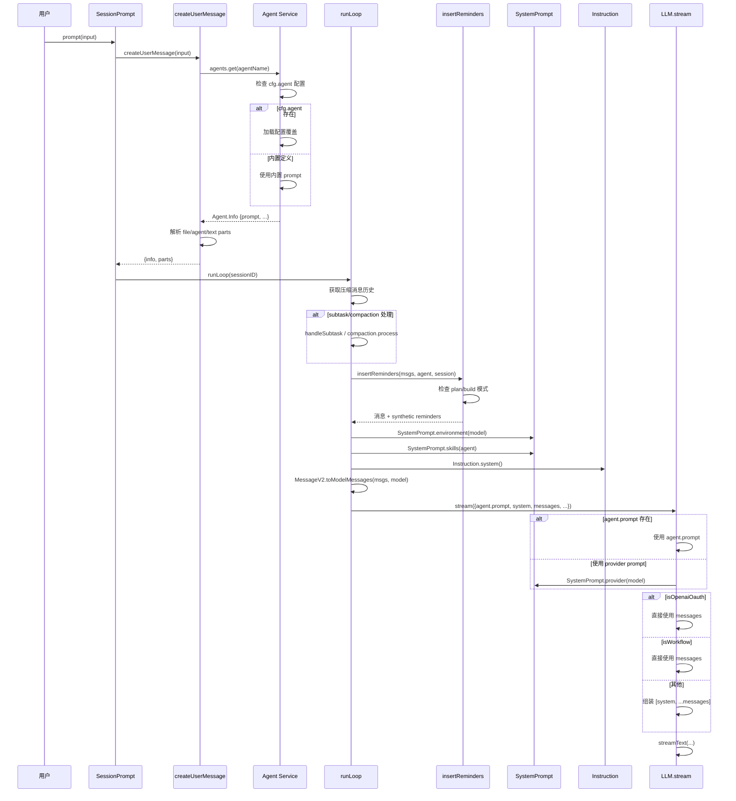
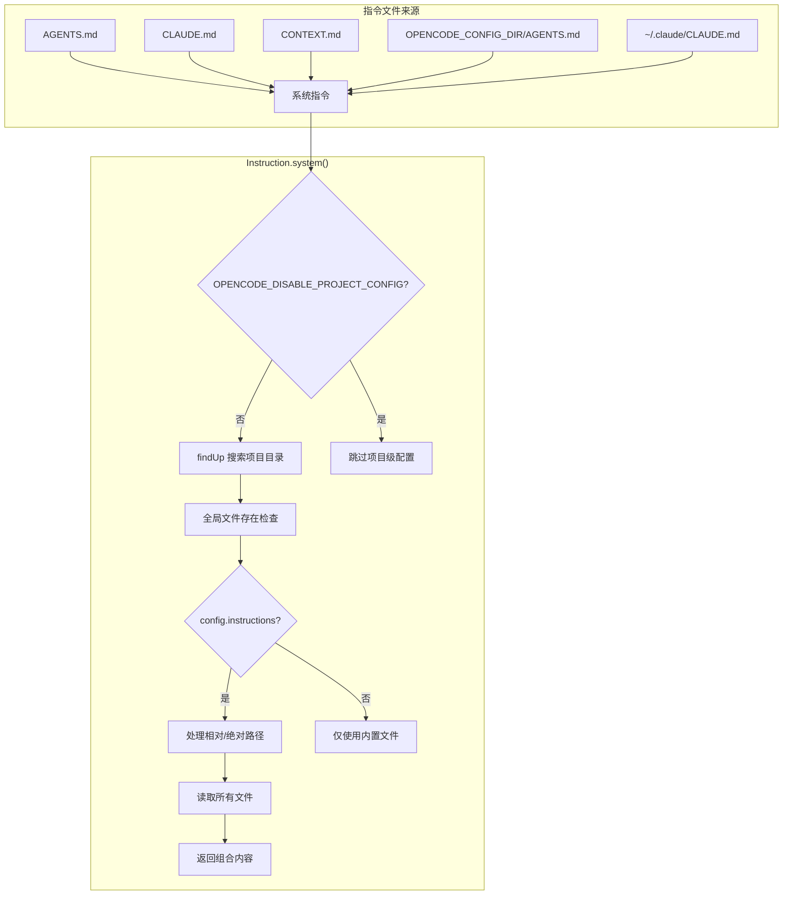

# OpenCode Prompt 组装流程分析

## 1. 概述

OpenCode 的 prompt 组装是一个多阶段过程,涉及系统提示、环境信息、技能、用户消息和对话历史的组合,最终形成发送给 LLM 的完整 prompt。

## 2. 核心文件

| 文件                                  | 职责                                                        |
| ------------------------------------- | ----------------------------------------------------------- |
| `src/session/prompt.ts` (1843 行)     | **主要 prompt 组装服务** - 协调整个 prompt 构建过程         |
| `src/session/llm.ts` (358 行)         | **LLM 流式服务** - 组合系统 prompt 并发送给 provider        |
| `src/session/system.ts` (50 行)       | **系统 prompt 提供者** - 选择和加载特定 provider 的 prompts |
| `src/prompt/registry.ts`              | **Prompt 注册表** - 将 prompt 名称映射到文件路径            |
| `src/prompt/loader.ts`                | **Prompt 加载器** - 支持缓存和 workspace 覆盖的 prompt 加载 |
| `src/session/instruction.ts` (258 行) | **指令加载器** - 加载 AGENTS.md、CLAUDE.md 和自定义指令文件 |
| `src/session/message-v2.ts` (1031 行) | **消息转换** - 将内部消息格式转换为 LLM 格式                |
| `src/agent/agent.ts`                  | **Agent 服务** - 定义内置 agent,支持通过配置覆盖 prompt     |
| `src/config/config.ts`                | **配置服务** - 定义 agent 配置结构,支持 prompt 字段覆盖     |

## 2.1 内置 Agent Prompts (registry.ts:91-96, agent.ts:179-228)

| Agent        | Prompt Key         | 默认文件                      | 用途              |
| ------------ | ------------------ | ----------------------------- | ----------------- |
| `explore`    | `agent.explore`    | `agent/prompt/explore.txt`    | 快速探索代码库    |
| `compaction` | `agent.compaction` | `agent/prompt/compaction.txt` | 消息压缩处理      |
| `title`      | `agent.title`      | `agent/prompt/title.txt`      | 生成会话标题      |
| `summary`    | `agent.summary`    | `agent/prompt/summary.txt`    | 生成会话摘要      |
| `generate`   | `agent.generate`   | `agent/generate.txt`          | 生成新 agent 配置 |

**Agent Prompt 覆盖优先级 (agent.ts:248):**

```typescript
item.prompt = value.prompt ?? item.prompt // 用户配置 > 内置默认值
```

**配置来源优先级 (config.ts:247-264, 1348-1364):**

1. `.opencode/agent/*.md` 或 `.opencode/agents/*.md`
2. `OPENCODE_CONFIG_DIR/agent/*.md`
3. 全局 `~/.opencode/agent/*.md`
4. 配置文件 `agent` 字段的 `prompt` 属性

## 3. 完整流程图



## 4. 关键条件分支详解

### 4.1 insertReminders 条件分支 (prompt.ts:241-318)



**核心逻辑:**

- **非实验模式 + plan agent**: 添加 plan prompt
- **非实验模式 + plan→build 转换**: 添加 build-switch prompt
- **实验模式 + 非 plan agent**: 检查 plan 文件是否存在
- **实验模式 + plan agent**: 使用 plan-mode prompt 模板

### 4.2 Provider 系统提示选择 (system.ts:11-25)

```typescript
const PROVIDER_MAP = [
  { pattern: (id) => id.includes("gpt-4") || id.includes("o1") || id.includes("o3"), name: "beast" },
  { pattern: (id) => id.includes("codex"), name: "codex" },
  { pattern: (id) => id.includes("gpt"), name: "gpt" },
  { pattern: (id) => id.includes("gemini-"), name: "gemini" },
  { pattern: (id) => id.includes("claude"), name: "anthropic" },
  { pattern: (id) => id.toLowerCase().includes("trinity"), name: "trinity" },
  { pattern: (id) => id.toLowerCase().includes("kimi"), name: "kimi" },
]
```

### 4.3 消息包装条件 (prompt.ts:1413-1429)



## 5. SYSTEM PROMPT 组合顺序 (llm.ts:102-114)



## 5.1 Agent Prompt 解析流程

```mermaid
flowchart TD
    subgraph AgentInit["Agent 初始化 (agent.ts:232-259)"]
        A[内置 agents 定义] --> B{cfg.agent 配置存在?}
        B -->|是| C[遍历 cfg.agent]
        B -->|否| Z[使用内置定义]

        C --> D{value.disable === true?}
        D -->|是| E[删除该 agent]
        D -->|否| F{agent key 存在?}

        F -->|否| G[创建新 agent 定义]
        F -->|是| H[使用现有定义]

        G --> I[覆盖配置]
        H --> I

        I --> I1{model?} -->|是| I1A[item.model = value.model]
        I --> I2{variant?} -->|是| I2A[item.variant = value.variant]
        I --> I3{prompt?} -->|是| I3A[item.prompt = value.prompt]
        I --> I4{description?} -->|是| I4A[item.description = value.description]
        I --> I5{temperature?} -->|是| I5A[item.temperature = value.temperature]
        I --> I6{steps?} -->|是| I6A[item.steps = value.steps]
        I --> I7{permission?} -->|是| I7A[item.permission = merge(item.permission, value.permission)]

        I1 --> I2
        I2 --> I3
        I3 --> I4
        I4 --> I5
        I5 --> I6
        I6 --> I7
        I7 --> Z

        E --> Z
    end
```

### Agent Prompt 配置方式

**方式一: 配置文件 (config.ts:914-929)**

```yaml
agent:
  explore:
    prompt: "You are a code exploration expert..."
```

**方式二: Markdown 文件 (config.ts:247-264)**

```
.opencode/agent/explore.md
或
.opencode/agents/explore.md
```

文件内容:

```markdown
---
description: Explore codebase quickly
mode: subagent
---

You are a code exploration expert...
```

### Agent Prompt 在 LLM.stream 中的使用 (llm.ts:104-106)



## 6. 完整消息流



## 7. 条件分支汇总表

| 位置                      | 条件                                     | 结果                        | 影响                           |
| ------------------------- | ---------------------------------------- | --------------------------- | ------------------------------ |
| `insertReminders:249`     | `!OPENCODE_EXPERIMENTAL_PLAN_MODE`       | 进入非实验 plan 模式分支    | 添加 plan 或 build-switch 提示 |
| `insertReminders:250`     | `agent.name === "plan"`                  | 添加 system.plan            | 启用 plan mode 提示            |
| `insertReminders:261-262` | `wasPlan && agent.name === "build"`      | 添加 system.build-switch    | plan→build 转换提示            |
| `insertReminders:276-294` | 实验模式 + 非 plan agent + plan 文件存在 | 添加 plan 文件路径          | 告知 LLM plan 文件位置         |
| `prompt.ts:1327-1330`     | `task.type === "subtask"`                | handleSubtask               | 子任务处理流程                 |
| `prompt.ts:1332-1341`     | `task.type === "compaction"`             | compaction.process          | 消息压缩流程                   |
| `prompt.ts:1344-1351`     | `isOverflow(lastFinished)`               | compaction.create           | 自动压缩                       |
| `prompt.ts:1402`          | `format.type === "json_schema"`          | 添加 structured output tool | 结构化输出模式                 |
| `prompt.ts:1413-1429`     | `step > 1 && lastFinished`               | 包装用户消息                | 添加 system-reminder           |
| `prompt.ts:1442-1444`     | `isLastStep`                             | 添加 system.max-steps       | 最后一步警告                   |
| `llm.ts:104-106`          | `agent.prompt` 存在                      | 使用 agent prompt           | Agent 特定提示                 |
| `llm.ts:149-161`          | `isOpenaiOauth \|\| isWorkflow`          | 直接使用 messages           | 不添加 system 角色             |
| `llm.ts:218-228`          | `isLiteLLMProxy && hasToolCalls`         | 添加 \_noop tool            | API 兼容性                     |
| `system.ts:42`            | `Permission.disabled("skill")`           | 跳过 skills                 | 技能系统开关                   |
| `agent.ts:248`            | `value.prompt` 存在                      | 使用用户配置的 prompt       | 覆盖内置 agent prompt          |
| `agent.ts:232-259`        | `cfg.agent` 存在                         | 从配置加载 agent 定义       | 支持文件/markdown 配置         |

## 8. 文件类型处理分支 (prompt.ts:1004-1166)

```mermaid
flowchart TD
    START{part.type === "file"} --> A{part.source.type}

    A -->|resource| B[MCP 资源读取]
    B --> B1[调用 mcp.readResource]
    B1 --> B2{成功?}
    B2 -->|是| B3[添加文本内容]
    B2 -->|否| B4[添加错误消息]

    A -->|url| C{url.protocol}

    C -->|"data:" & text/plain| D[解码 DataURL]
    C -->|"file:" & text/plain| E[文件读取]
    E --> E1{使用 LSP 符号?}
    E1 -->|是| E2[范围重定位]
    E1 -->|否| E3[直接读取]
    E2 --> E3
    E3 --> E4[返回输出]

    C -->|"file:" & directory| F[目录读取]
    C -->|"file:" & 其他| G[Base64 编码]
```

## 9. 指令文件加载 (instruction.ts:19-35, 164-178)



## 10. 总结

1. **Prompt 解析是多层的**: Provider 特定 → Agent 特定 → 用户指定 → 指令文件
2. **条件分支显著影响流程**: `insertReminders()` 处理 plan/build 模式转换
3. **系统 prompt 可来自多个来源**: Provider、agent 配置、用户消息、指令文件(AGENTS.md)
4. **支持 workspace 覆盖**: 可通过 `.opencode/prompts/` 目录覆盖默认 prompts
5. **技能系统可选**: 由 agent permissions 控制
6. **结构化输出是特殊模式**: 改变工具和系统 prompt
7. **内置 agent prompt 可配置**: `explore`、`compaction`、`title`、`summary` 等内置 agent 的 prompt 可通过配置文件或 markdown 文件覆盖
